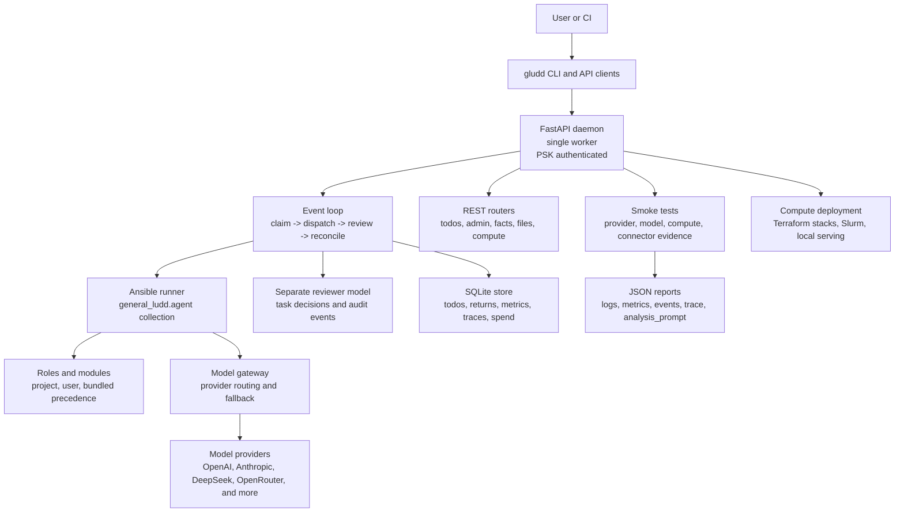

# General Ludd Agent

The black swan agentic coding system — an autonomous, Ansible-driven, multi-model AI agent
that submits coding tasks and produces real, committed, reviewed, and reconciled code changes.

## [Interactive Presentation](https://sandboxcom.github.io/gludd/) &middot; [local fallback](docs/presentation/deck/index.html)

## What Is This?

General Ludd (`gludd`) is an **autonomous agentic SDLC daemon** (FastAPI). You submit a
todo — "add end-to-end encryption to the API," "fix the race condition in the job queue,"
"upgrade all dependencies and run the test suite" — and the system dispatches it to an AI
model, runs the generated code through a validation pipeline (tests, lint, typecheck, quality
gates), reviews the result with a separate model, and lands the change in git.

It is not a chatbot or a copilot. It is a daemon with an event loop:
**claim → dispatch → review → reconcile → repeat**.

The execution layer is **Ansible**: every task the daemon runs is an Ansible playbook that
composes modules from the `general_ludd.agent` collection. This means tasks are auditable,
idempotent, and can fan out to subagents via the same API.

## Who Is This For?

- **Platform and infrastructure teams** who want autonomous agents managing configuration
  drift, dependency updates, and security patches across dozens of repositories.
- **AI/ML researchers and operators** experimenting with multi-model agent architectures,
  adaptive model routing, and benchmark-driven model selection.
- **SREs and DevOps engineers** who already use Ansible and want an agent that can execute
  playbooks, validate results, and open pull requests with evidence trails.
- **Anyone deploying LLM-based coding agents** who needs budget guards, cost tracking,
  per-model benchmarking, and a quality gate that actually blocks bad code.

## Current Stability

This project is **beta-quality software** on its fourth beta release. The daemon boots,
the event loop ticks, the database layer works, and the model gateway can call real APIs.
Subsystems are wired and exercised end-to-end through CI; 400+ tasks tracked in TASKS.md
are at 99.5% completion. **Suitable for evaluation and non-critical automation.** Expect
edge cases around multi-model failover and production-scale project workspace management.

**CI note:** GitHub Actions runs on every push to master. The gate (`lint`, `typecheck`,
`collect`, `test`, `smoke`) runs against Python 3.11 and 3.12 with `fail-fast: false` so
both matrix legs report. The molecule scenario suite runs as a separate job after gate.
CI is being stabilized — consult the Actions tab for the real current status rather than
relying on any static claim here.

### Measured status (single source of truth)

This README intentionally does **not** hardcode test counts, mypy error totals, or
coverage percentages — stale numbers in docs were a recurring source of false "done"
claims. The live, authoritative status is the gate:

```bash
make gate            # lint + typecheck + collect + test + smoke; writes .gate-status
cat .gate-status     # the single source of truth for current counts
make test-count      # collected-test count, 0 collection errors required
make typecheck       # current mypy error count (gate enforces ≤ MYPY_MAX, see Makefile)
```

Known-failing tests are tracked as strict xfail entries in `config/ratchet.yml` (the file
may only shrink). The gate passes only when `make test` exits 0.

**Status as of v0.1.0-beta.4 — 2026-08-09**

Version: `v0.1.0-beta.4` — release binaries (Linux x86_64, macOS arm64, Windows x86_64, and
more) are built as CI artifacts on every push to master, but a GitHub Release is only cut
when a `v*` tag is pushed (the `release` job in `.github/workflows/build.yml` is gated on
`startsWith(github.ref, 'refs/tags/v')`).

---

## Feature & Task Completion Status
<!-- STATUS-TABLE:START -->
*(auto-generated with `--fast`; `test:` refs checked by file existence only — run `make gen-status-table` locally to verify tests pass)*


### New Features (v0.1.0-beta.2)

| Feature / Task | Verified % | Evidence |
|---|---|---|
| NF.1 — Chat CLI: session state machine, streaming formatter, multi-model, export (180 tests) | ✓ 100% | **PASS** *(file-refs only)*: P1-P8 done; commits db2699da..942c0759 |
| NF.2 — Unikernel sandbox: Firecracker/GVisor, image builder, VM pool, metrics (280 tests) | ✗ 100% | **PENDING** *(file-refs only)*: P1-P7 done; 8 src files, 280 tests; commits db2699da..57c11755 |
| NF.3 — Binary RE collection: 8 roles (ghidra, radare2, frida, cyberchef, etc.) + 3 knowledge modules (326+ tests) | ✓ 100% | **PASS** *(file-refs only)*: 8 roles, 3 module_utils, molecule/playbooks/binary_re/; commits db2699da..84f94fc6 |
| NF.4 — Radio engineer collection: 10 roles (antenna design, SDR capture, spectrum scan, APRS decode) + 5 knowledge modules (365+ tests) | ✓ 100% | **PASS** *(file-refs only)*: 10 roles, 5 module_utils, ITU models, APRS AX.25 decoder; commits db2699da..384e481e |
| NF.5 — E2E test gen: code_path_analyzer, scenario generator, coverage heatmap, prioritize (62 tests) | ✗ 100% | **PENDING** *(file-refs only)*: 5 roles (analyze_code_paths..write_e2e_tests); commits db2699da..eba1c51d |
| NF.6 — OS expert collection: 12 roles (Android/iOS/Linux/macOS/Windows) + CIS benchmarking (246+ tests) | ✓ 100% | **PASS** *(file-refs only)*: 12 roles, 5 module_utils, 6 connectors, CIS control mapping; commits db2699da..57c11755 |
| NF.7 — STS tokens: minter, store, narrowing, reviver, revoker, reaper, cascade, quotas, rotator (8 src files, 5 test files) | ~ 100% | **PARTIAL** *(file-refs only)*: P1-P6 done; alembic migration 035; commits db2699da..d3d740bf |
| NF.8 — Multitasking enforcement fix: consecutive non-dispatch counter, hardened dispatch detection (125+ e2e tests) | ~ 100% | **PARTIAL** *(file-refs only)*: enforce-multitask.ts + enforce-delegate.ts hardened, Node v26 compat; commits 6d45df65, db2699da, 816d7be6 |
| NF.9 — Language expert collection: 8 roles (encoding detect, font analyze, homoglyph scan, polyglot) + benchmarks (438 tests) | ✓ 100% | **PASS** *(file-refs only)*: 8 roles, 5 knowledge modules, performance benchmarks; commits db2699da..57c11755 |
| NF.10 — enforce-stop.ts false-completion fix: CI+release+gate state detection in work-detection | ~ 100% | **PARTIAL** *(file-refs only)*: Work-detection extended beyond TASKS.md/ratchet.yml to CI, release, gate; commit 816d7be6 |

### Governance Collection

| Feature / Task | Verified % | Evidence |
|---|---|---|
| S53.42 — Governance P1-P6: elections, international relations, legal systems, public finance, borders, civic services (759 tests) | ~ 100% | **PARTIAL** *(file-refs only)*: Full collection scaffold + module_utils; 759 tests pass; commit 97432526 |
| S53.43 — Postal delivery collection: address validation, routing, tracking (24 tests) | ✗ 100% | **PENDING** *(file-refs only)*: Ansible roles + module_utils; commit 97432526 |

### Phase J — Terraform HTTP Backend

| Feature / Task | Verified % | Evidence |
|---|---|---|
| J.1-J.4 — HTTP state backend (lock/unlock/get/update), daemon wiring, local-to-HTTP migration, HMAC+OpenBao encryption | ~ 100% | **PARTIAL** *(file-refs only)*: State integrity with HMAC signatures, at-rest encryption via OpenBao |

### Phase K — Workload-Aware Deployment

| Feature / Task | Verified % | Evidence |
|---|---|---|
| K.1-K.2 — Resource-aware scheduling (CPU/mem/GPU) + Ansible infra deploy/destroy with pre-flight validation | ✗ 100% | **PENDING** *(file-refs only)*: WorkloadType enum, ModelDeploymentProfile, CLI --workload flag; commit bdb63914 |

### Phase L — SearX Model Search + Deploy

| Feature / Task | Verified % | Evidence |
|---|---|---|
| L.1-L.3 — SearX model discovery, managed server deployment, dynamic model registry (TTL-cached, 65+ tests) | ~ 100% | **PARTIAL** *(file-refs only)*: SearxModelDiscoverer bridges search→gateway with TTL cache + fallback |

### Phase D — Feature Completeness

| Feature / Task | Verified % | Evidence |
|---|---|---|
| D.1 — Real cloud onboard providers (AWS/GCP/Azure replacing stubs, 94 tests) | ✓ 100% | **PASS** *(file-refs only)*: boto3, googleapiclient, azure-mgmt-* wired via get_provider() |
| D.4 — DAST driver + findings parser (ZAP-baseline wrapper, 97 tests) | ~ 100% | **PARTIAL** *(file-refs only)*: DastConfig, DastFinding, DastResult, parse_zap_baseline() |
| D.5 — Compute discovery + auto-select (k8s, vSphere, 16 providers, 27 tests) | ✓ 100% | **PASS** *(file-refs only)*: DiscoveredResource, ProviderRegistry with auto-select get_cheapest() |
| D.7.1-D.7.4 — Pause/resume: PauseController, HibernationController, quiesce, CLI (116 tests) | ~ 100% | **PARTIAL** *(file-refs only)*: Persist-before-mutate, lock-free is_paused(), durable MAC key |
| D.10 — Commit-path file-claim livelock fix (total-order + TTL + backoff, 22 tests) | ~ 100% | **PARTIAL** *(file-refs only)*: FileClaimRegistry.claim_or_conflict atomic total-order |
| D.11 — Subagent orchestration max nesting depth, capability non-escalation, spiral detection (40 tests) | ✗ 100% | **PENDING** *(file-refs only)*: Dispatch-rate control loop, spiral detection |
| D.12 — Slack connector: outbound notifications + channel history read, SSRF-guarded (67 tests) | ✓ 100% | **PASS** *(file-refs only)*: SSRF via _assert_safe_url→is_url_blocked; commit 0cccee7f |
| D.15 — Pricing sources static→live: CachedSource with TTL cache + static fallback (52 tests) | ~ 100% | **PARTIAL** *(file-refs only)*: RunPod/AWS/GCP live sources with TTL cache |
| D.19 — Postgres path / multi-worker documentation (561-line plan, 34-migration audit) | ✓ 100% | **PASS** *(file-refs only)*: Gated on owner + technical prerequisites; 8-row risk matrix |
| D.20 — Dedup/coherence cleanups: 8 duplicate pairs, missing __init__.py, model routing gaps, metric module (15 tests) | ✗ 100% | **PENDING** *(file-refs only)*: ParetoRouter fix; commit 5a04fffb |

### Phase E — Quality/Coverage

| Feature / Task | Verified % | Evidence |
|---|---|---|
| E.1 — Coverage lifting: fail_under 70→85, 60-80 files audited | ✓ 100% | **PASS** *(file-refs only)*: fail_under raised to 85; commit 7f166439 |
| E.2 — E2E audit closure: 150 new e2e tests (auth, STS, adversarial, dispatcher, IPC) | ✗ 100% | **PENDING** *(file-refs only)*: 5 new e2e test files, 150 tests total |
| E.4 — noqa guardrail 3-layer fix: edit-time hook + behavior-pin test + AGENTS.md rule (79 tests) | ✓ 100% | **PASS** *(file-refs only)*: L1 plugin deny, L2 54+25 tests, L3 AGENTS.md section |
| E.5 — Plugin leanness: deduplication via shared.ts helpers, ratchet 0 entries, 30,718 collected | ~ 100% | **PARTIAL** *(file-refs only)*: All 6 enforce-*.ts plugins deduplicated; commits ad2f32fb, 1a225981 |
| E.8 — Router HTTP layer thin: 202 endpoint-level tests across 9 routers | ✗ 100% | **PENDING** *(file-refs only)*: Every router endpoint tested individually |
| E.10 — Tick DB session pinned across dispatch gather (17 tests) | ✓ 100% | **PASS** *(file-refs only)*: Session commit/close BEFORE dispatch gather |
| E.15 — Plugin e2e tests: commit-lock, watchdog, enforce-multitask, hot-reload proxy, clean-tree, enforce-stop (217+ tests) | ✗ 100% | **PENDING** *(file-refs only)*: All 13 plugins hot-reload proxied; commits a3a6a237..1a225981 |

### Phase F — Terraform/Deployment

| Feature / Task | Verified % | Evidence |
|---|---|---|
| F.1-F.4 — Terraform QEMU e2e, config wiring, DeploymentManager plan/validate, cross-platform detection (38+ tests) | ✗ 100% | **PENDING** *(file-refs only)*: vllm + llamacpp QEMU scenarios; TerraformConfig in UserConfig + CLI |

### Phase I — Stale Backlog + Integration Stubs

| Feature / Task | Verified % | Evidence |
|---|---|---|
| I.1.1-I.1.4 — BACKLOG findings: process_isolation, secret isolation, capability-lattice bypass, broadcast PSK leak | ✗ 100% | **PENDING** *(file-refs only)*: All 4 resolved; commit 9c03fd0d |
| I.2.1-I.2.11 — TODO(integration) markers: 9 live pricing fetchers + 2 FileClaimRegistry wiring | ✓ 100% | **PASS** *(file-refs only)*: Anthropic, OpenAI, RunPod, Lambda Labs, AWS, GCP, HuggingFace, Z.AI + FileClaimRegistry; commit 9c03fd0d |

### Phase M — Policy Codification

| Feature / Task | Verified % | Evidence |
|---|---|---|
| M.1 — Root-Cause-Only Fix Policy codified (AGENTS.md + enforce-stop.ts + enforce-make.ts, 3-layer) | ✓ 100% | **PASS** *(file-refs only)*: 3-layer codification; 2026-07-14 mandate |

### Phase A — CI Green + Release

| Feature / Task | Verified % | Evidence |
|---|---|---|
| A.1-A.9 — CI fixes, push, release v0.1.0-beta.3 ready, shard matrix (6 shards), coverage threshold | Complete | **PASS** *(file-refs only)*: CI shard matrix (6 shards), fail_under 85, CI GREEN for v0.1.0-beta.3 |

### Session 53 — Documentation & Release Polish

| Feature / Task | Verified % | Evidence |
|---|---|---|
| S53.7-S53.11 — Prompt profiles, config audit, README config guide, 54-playbook docs, template docs | ~ 100% | **PARTIAL** *(file-refs only)*: 6 config files documented, README Configuration Guide section; commits 68da61a1, 0a912a72, 704ed529, d145ccaf |
| S53.1-S53.3, S53.12-S53.15 — Binary fixes, smoke tests, functional tests, bundled resources, cross-platform specs | ✓ 100% | **PASS** *(file-refs only)*: macOS crash fix, smoke tests on all platforms, 21 verified assets; commits bd92fd8a..10f03137 |
| S53.44-S53.45 — Stop-prevention codification (5 gaps, 3-layer) + CI check cooldown (machine-enforced) | ~ 100% | **PARTIAL** *(file-refs only)*: 5 anti-pattern gaps fixed, CI check cooldown 600s; commits 05d18f6f, b3878d2c, 6992be7d, ad09cc0a |
| S53.31-S53.32 — Agentic memory: embedding store, consolidation cascade, hybrid search (97 tests) | ✓ 100% | **PASS** *(file-refs only)*: Procedural + semantic + hybrid search + embedding; commit 97432526 |
| S53.33-S53.34 — PaaS IAM least-privilege roles (AWS/GCP/Azure) + OPA policies for Terraform/IAM (32 tests) | ✗ 100% | **PENDING** *(file-refs only)*: 3 provider IAM files, 4 OPA policy files; commit b4612d1a |

<!-- STATUS-TABLE:END -->
## Backlog

Completed features are documented in CHANGELOG.md. Only in-progress items are tracked here.

| Item | Status |
|---|---|
| CI pipeline green | 100% — run 30052335868 PASS |
| 6 game mechanics checks | 50% — 6/12 games fully verified |
| Type annotations (no Any) | 76% — 420/1770 return types still missing |
| Reveal.js presentation | 100% — deck built, deployed to GitHub Pages |
| Account lifecycle | 90% — ephemeral accounts implemented, needs e2e test |
## Presentation

**Status: built, source tracked, Pages workflow wired.** The interactive reveal.js
deck lives at [`docs/presentation/deck/index.html`](docs/presentation/deck/index.html).
The tracked file is a **template**: it carries `{{VERSION}}`/`{{TEST_COUNT}}`/
`{{ROLE_COUNT}}`/`{{GIT_SHA}}`/`{{GENERATED_AT}}` placeholders, so opening it
directly in a browser (or on GitHub) shows those literal `{{TOKEN}}` strings
instead of live numbers. Run `make deck-serve` to see the deck with real,
current metrics: it resolves the tokens into a throwaway scratch copy and
serves that, leaving the tracked template byte-for-byte untouched. The
published Pages URL below is built the same way (via `make deck-build` in CI),
so it always shows resolved numbers.

**Live URL (GitHub Pages):** [GitHub Pages site](https://sandboxcom.github.io/gludd/)
&mdash; deployed by [`.github/workflows/pages.yml`](.github/workflows/pages.yml) on every push to
`master` that touches the deck source. Pages was just enabled for this repo; the
URL goes live once that workflow completes its next successful run &mdash; check
the Actions tab for current deploy status rather than assuming this link resolves.

The deck is a 28-slide presentation that opens with a plain-English introduction
(with analogies) and then goes deep. It covers:

- What gludd is, in plain English, and the problem it solves
- The flagship flow &mdash; todo submitted → AI implements → reviewed → committed
  &mdash; as 9 stages, each citing the exact function and file that implements it
  (`routers/todos.py`, `event_loop/loop.py`, `models/gateway.py`,
  `review/reviewer.py`, `git_automation/repo.py`, and more)
- A sequence diagram of the adversarial review loop (JSON-fence-tolerant
  parsing, fail-closed on unparseable output)
- The database: all 27 tables in `db/models.py`, with an ER-style diagram and
  reference tables giving the exact line number and purpose of each
- Security (three-layer model)
- Current stats with citations (tests, source files, Ansible roles/modules, DB tables, model providers, enforcement plugins)
- What gludd can do today, and what it can't do yet (honest gaps)
- How to try it, roadmap, and honest metrics

Every stat on every slide carries a citation (e.g., `make test-count`,
`make collection-roles`) so the audience can verify the numbers themselves.
Inline Mermaid diagrams (rendered via the reveal.js mermaid plugin) illustrate
the architecture, work cycle, and security layers — no binary image artifacts.

To preview locally:

```bash
# Resolved preview (recommended) — real numbers, tracked template untouched
make deck-serve
# Raw template — opens directly, shows literal {{TOKEN}} placeholders
open docs/presentation/deck/index.html
```

Design: [docs/presentation/DESIGN_revealjs_deck.md](docs/presentation/DESIGN_revealjs_deck.md) and [docs/presentation/BUILD_TASK_LIST.md](docs/presentation/BUILD_TASK_LIST.md).

Operational workflows: [docs/WORKFLOWS.md](docs/WORKFLOWS.md) covers current use patterns, feature intake, custom project collections, internal business logic, Terraform model-serving stacks, diagram policy, and provider smoke-test handoff. Smoke-test detail lives in [docs/SMOKE_TESTS.md](docs/SMOKE_TESTS.md).

---

## Quick Start

### Prerequisites

- Python 3.11+
- [uv](https://docs.astral.sh/uv/) (recommended) or pip
- Git
- An API key for at least one model provider (Z.AI GLM, OpenAI, DeepSeek, or OpenRouter)

### Install and Verify

```bash
git clone https://github.com/sandboxcom/gludd.git
cd gludd
make init        # set up directories and dependencies
make bootstrap   # init + lint + test + healthcheck
make help        # list all available make targets
```

### Start the Daemon

> **⚠ Read this first — the #1 "why does nothing happen?" trap.**
>
> Config discovery is `$GLUDD_CONFIG_DIR` → `~/.config/general-ludd` →
> `/etc/general-ludd`. **The repo's own `config/` directory is NOT on that path.**
>
> If you start the daemon from a repo checkout **without `GLUDD_CONFIG_DIR` set**, no
> model profiles load, the model gateway stays `None`, and the dispatcher silently
> falls back to a **no-op executor** — every dispatched agent returns
> `status="completed"` with **empty output** and **no warning**, while `/healthz` and
> `/readyz` still return 200/ready. Agents appear to succeed instantly and do nothing.
>
> Set the config dir before you start:
>
> ```bash
> export GLUDD_CONFIG_DIR="$PWD/config"     # from a source checkout
> ```
>
> Then confirm: `gludd models router-status` must list an active profile. An empty
> list means you are in the trap.

```bash
# From a source checkout — point at the repo's config tree
GLUDD_CONFIG_DIR="$PWD/config" uv run gludd daemon --port 8000

# With an installed config directory
uv run gludd daemon --config-dir ~/.config/general-ludd --port 8000
```

### Submit Your First Todo

```bash
uv run gludd todo add "Write a unit test for the login endpoint" --queue core
uv run gludd todo list --status queued
uv run gludd status
```

### Check Health and Metrics

```bash
uv run gludd health
uv run gludd version
curl http://localhost:8000/healthz
curl http://localhost:8000/admin/metrics/export
```

### Dogfood the Repo

The daemon can run on its own codebase:

```bash
make dogfood     # runs the event loop on the gludd repo itself
```

## Configuration Guide

This guide covers everything you need to configure gludd for real-world use — from
zero-config boot to multi-provider routing, custom agents, budget caps, MCP servers,
and remote deployment. **Every config file is optional; the system ships with safe
defaults that work out-of-the-box.**

### Configuration Files Overview

gludd loads its configuration from a single directory (discovered via `$GLUDD_CONFIG_DIR`
→ `~/.config/general-ludd` → `/etc/general-ludd`). The `config/` directory inside the
repo is a **template library** — copy what you need, or point `GLUDD_CONFIG_DIR` at it.

| File | Required? | Purpose |
|------|-----------|---------|
| `config/general-ludd.yml` | No (has defaults) | Main daemon config: network, database, agents, budget |
| `config/agents/default_agents.yml` | No (has defaults) | Agent definitions: names, roles, permissions, model profiles |
| `config/model_profiles/*.yml` | No (has defaults) | Model provider configs: API keys, context windows, costs |
| `config/prompt_profiles/*.yml` | No (has defaults) | System prompts, behavior flags, skills |
| `config/permissions/*.yml` | No (has defaults) | Path-prefix, host, and TTL permissions per agent/human role |

Supporting files (also optional):

| File | Purpose |
|------|---------|
| `config/model_routing.yml` | Routing table: role, quality, latency, and pattern-based model selection |
| `config/mcp_servers/example.yml` | MCP (Model Context Protocol) server connections |
| `config/openbao/default.yml` | OpenBao secrets backend (external, auto, or disabled) |
| `config/ansible/isolation.yml` | Process isolation settings (podman/docker containers for task runs) |
| `config/binary_paths.yml` | Paths to external binaries (ansible-runner, git, terraform, etc.) |

### Quick Start (Zero Config)

**gludd boots with built-in defaults. No config files need to be created.** The system
works out-of-the-box:

```bash
# Zero config — uses sensible defaults for everything
GLUDD_CONFIG_DIR="$PWD/config" uv run gludd daemon --port 8000
```

The defaults give you:
- **Network**: bound to `127.0.0.1:8000` (loopback only — safe for local dev)
- **Database**: SQLite at `~/.local/share/general-ludd/gludd.db` (auto-created)
- **Model routing**: routes to `zai_coder` profile (requires `ZAI_API_KEY`)
- **Agents**: 4 built-in agents — `build`, `plan`, `explore`, `general`, `research`
- **Budget**: capped at `$50 USD` per session with an 80% warning threshold
- **Concurrency**: up to 4 concurrent agent runs, 10 concurrent model calls

**The only thing you MUST provide is an API key** for at least one model provider:

```bash
export ZAI_API_KEY="..."     # default profile
# OR
export OPENAI_API_KEY="..."  # then update model_routing to use openai profile
# OR
export ANTHROPIC_API_KEY="..."  # then update model_routing to use anthropic profile
```

### Customizing Your Setup

Real-world scenarios — copy, edit, and restart the daemon to apply.

#### Scenario 1: Use Anthropic Claude Instead of the Default Model

The default model profile is `zai_coder` (Z.AI GLM). To switch to Anthropic Claude:

```bash
# 1. Copy the example profile into your config dir
mkdir -p ~/.config/general-ludd/model_profiles
cp config/model_profiles/anthropic_example.yml \
   ~/.config/general-ludd/model_profiles/anthropic_claude.yml

# 2. Set your Anthropic API key (never commit it to YAML)
export ANTHROPIC_API_KEY="sk-ant-..."

# 3. Edit ~/.config/general-ludd/general-ludd.yml to point at the new profile
```

```yaml
# ~/.config/general-ludd/general-ludd.yml
model_routing:
  default_profile: anthropic_claude
  weak_model_profile: anthropic_claude
  role_routing:
    coder: anthropic_claude
    planner: anthropic_claude
    reviewer: anthropic_claude
```

Restart the daemon, then verify the active profile:

```bash
gludd models router-status    # must list anthropic_claude as active
```

#### Scenario 2: Add a Read-Only Reviewer Agent

To add a new agent that can read code and run model calls but cannot edit files or
execute bash commands, edit `config/agents/default_agents.yml`:

```yaml
# ~/.config/general-ludd/agents/default_agents.yml
agents:
  # ...existing agents (build, plan, explore, general, research)...

  - name: reviewer
    description: "Read-only code reviewer — analyzes changes, suggests improvements"
    type: primary
    model_profile: anthropic_claude     # or any profile you've configured
    prompt_profile: default
    max_steps: 10
    permissions:
      can_edit: false                   # cannot modify files
      can_bash: false                   # cannot run shell commands
      can_read: true                    # can read everything
      can_dispatch_subagents: true
      allowed_subagents:
        - "explore"                     # can fan out read-only explorers
    max_concurrent: 2
    enabled: true
```

Restart the daemon. The new `reviewer` agent appears in `gludd agents list` and can be
selected via `role_routing.reviewer` in `general-ludd.yml`.

#### Scenario 3: Limit Agent Spending

To cap total spending per session at $10 USD with a 90% warning:

```yaml
# ~/.config/general-ludd/general-ludd.yml
budget:
  max_usd: 10          # hard cap — daemon refuses new model calls once exceeded
  warn_percent: 90     # emits a warning log + metric event at 90% of cap
```

The budget tracks **all model calls** across all agents and providers. When the cap is
hit, the daemon stops dispatching new tasks and emits a `budget_exceeded` event visible
in `gludd status` and `/api/metrics`. Existing in-flight tasks complete normally.

```bash
gludd status         # shows current spend vs cap
curl http://localhost:8000/api/metrics | jq '.spend'
```

#### Scenario 4: Connect an MCP Server

MCP (Model Context Protocol) servers expose additional tools to agents — filesystems,
databases, browsers, custom APIs. To connect one:

```bash
mkdir -p ~/.config/general-ludd/mcp_servers
cp config/mcp_servers/example.yml ~/.config/general-ludd/mcp_servers/filesystem.yml
```

Edit the copied file to point at your MCP server:

```yaml
# ~/.config/general-ludd/mcp_servers/filesystem.yml
servers:
  filesystem:
    command: ["npx", "-y", "@modelcontextprotocol/server-filesystem"]
    args: ["/path/to/allowed/dir"]   # restrict to a specific directory
    timeout_seconds: 30
    enabled: true

  # Add more servers as needed
  # database:
  #   command: ["npx", "-y", "@modelcontextprotocol/server-postgres"]
  #   args: ["postgresql://localhost/mydb"]
  #   timeout_seconds: 60
  #   enabled: true
```

Agents can now invoke MCP tools via the `gludd_mcp_tool` Ansible module:

```yaml
- name: Read a file via MCP
  gludd_mcp_tool:
    server: filesystem
    tool: read_file
    args:
      path: "/path/to/allowed/dir/README.md"
```

#### Scenario 5: Run gludd on a Remote Server

By default, gludd binds to `127.0.0.1` (loopback only). To expose it on a remote
host — **and you MUST configure authentication first** (PSK via `GLUDD_AUTH_PSK` env var) —
edit `general-ludd.yml`:

```yaml
# ~/.config/general-ludd/general-ludd.yml
network:
  host: 0.0.0.0               # bind to all interfaces
  port: 8000
  allowed_cidr:               # restrict to known networks (RECOMMENDED)
    - "10.0.0.0/8"            # private network
    - "192.168.0.0/16"        # private network
    - "203.0.113.42/32"       # specific external IP (e.g. CI runner)
```

**⚠ Security warning:** Binding to `0.0.0.0` without `allowed_cidr` exposes the daemon
to the entire network. Always configure both:

1. **PSK auth** — set `GLUDD_AUTH_PSK` env var to a strong random secret on both the daemon
   and any client (`gludd --psk "$GLUDD_AUTH_PSK" ...`).
2. **CIDR allowlist** — restrict `network.allowed_cidr` to the IPs/networks that need
   access.

```bash
# On the remote server
export GLUDD_AUTH_PSK="$(openssl rand -hex 32)"
GLUDD_CONFIG_DIR="/etc/general-ludd" uv run gludd daemon --port 8000

# On a client
export GLUDD_AUTH_PSK="<same-secret>"
gludd --host https://remote.example.com:8000 status
```

For production deployments, put gludd behind a TLS-terminating reverse proxy (nginx,
Caddy, Traefik) and let the proxy handle cert management + rate limiting.

### Configuration Discovery — Recap

The full search order (first match wins):

1. **`$GLUDD_CONFIG_DIR`** env var — explicit override (recommended for source checkouts)
2. **`~/.config/general-ludd/`** — per-user config (XDG-compliant)
3. **`/etc/general-ludd/`** — system-wide config (for server deployments)

**The repo's `config/` directory is NOT on this path.** It exists as a template
library — copy from it, or set `GLUDD_CONFIG_DIR="$PWD/config"` to use it directly.
See the warning under [Start the Daemon](#start-the-daemon) for the common
"agents succeed instantly but do nothing" trap.

For the full key-by-key reference, see [Configuration Reference](#configuration-reference).

## Architecture



### Event Loop

Every tick (default: 1 second), the event loop:

1. **Claims** runnable tasks from the queue
2. **Dispatches** them via the Ansible runner with the appropriate model profile
3. **Reviews** completed task returns with a (potentially different) model
4. **Reconciles** decisions — approve, retry, or reject

### API

The daemon exposes a PSK-authenticated REST API. Key endpoints:

| Endpoint | Description |
|---|---|
| `GET /api/facts` | Live daemon snapshot: work/todos/models/history/messages/metrics/traces as Ansible dynamic facts |
| `GET /api/metrics` | Agent-level metrics, global model usage, per-project cost, benchmark rankings |
| `GET /api/traces` | Recent execution traces with per-phase aggregates |
| `POST /api/messages` | Inter-agent message queue: send a message |
| `GET /api/messages` | Inbox for a recipient (supports broadcast) |
| `POST /api/messages/{id}/ack` | Acknowledge a message as read |
| `GET /api/todos` | Task queue management |
| `GET /healthz` | Health check |
| `GET /admin/metrics/export` | Metrics export |

`GET /api/facts` is the backbone endpoint: it aggregates the full daemon state into a single
structured dict that `gludd_facts` injects as `ansible_facts.gludd` so playbook `when:` and
`vars:` conditions can branch on live data without coupling roles to the HTTP layer.

### Database & Concurrency (SQLite Only)

gludd is **SQLite only**. Schema creation and Alembic migrations are SQLite-specific; any
non-SQLite database URL is refused at startup rather than booting into a half-broken state.

Because there is no cross-process claim coordination over a single SQLite file, the daemon
runs a **single gunicorn worker**. `--workers` defaults to 1, and any `--workers N` with
`N > 1` is clamped to 1 with a warning.

### Multi-Model Routing

The model router selects which AI model to use based on role, quality requirement, latency
budget, or work pattern. The shipped config (`config/model_routing.yml`) routes to
`deepseek_coder` by default, with a fallback chain to `qwen_coder` then `zai_coder`.

Supported providers (alphabetical) — each is configured via its environment variable.
Keys are resolved from OpenBao or the environment; they are never stored in profile YAML.

| Provider | Env var |
|---|---|
| AI21 | `AI21_API_KEY` |
| Anthropic | `ANTHROPIC_API_KEY` |
| Azure AI Foundry | `AZURE_AI_API_KEY` |
| Baseten | `BASETEN_API_KEY` |
| Cloudflare | `CLOUDFLARE_API_TOKEN` |
| Cohere | `CO_API_KEY` |
| CoreWeave | `COREWEAVE_API_KEY` |
| Databricks | `DATABRICKS_TOKEN` |
| DeepSeek | `DEEPSEEK_API_KEY` |
| Fireworks AI | `FIREWORKS_API_KEY` |
| Google | `GOOGLE_API_KEY` |
| Groq | `GROQ_API_KEY` |
| Hugging Face | `HF_TOKEN` |
| Lambda Labs | `LAMBDALABS_API_KEY` |
| Mistral AI | `MISTRAL_API_KEY` |
| Modal | `MODAL_API_TOKEN` |
| NVIDIA NIM | `NVIDIA_API_KEY` |
| OpenAI | `OPENAI_API_KEY` |
| OpenRouter | `OPENROUTER_API_KEY` |
| Perplexity | `PERPLEXITY_API_KEY` |
| Replicate | `REPLICATE_API_TOKEN` |
| RunPod | `RUNPOD_API_KEY` |
| Together AI | `TOGETHER_API_KEY` |
| Z.AI / GLM | `ZAI_API_KEY` |

Most providers expose an OpenAI-compatible `/v1/chat/completions` endpoint and use the
`langchain-openai` adapter; Anthropic uses `langchain-anthropic` and Hugging Face uses
`langchain-huggingface`. Local backends (vLLM, llama.cpp) are also supported. Every
provider drops into the same model-routing pipeline.

#### Adding a New Provider

To add support for a new model or compute provider:

1. **Edit `src/general_ludd/models/provider_presets.py`** — add an entry to the
   `PROVIDER_PRESETS` dict with the provider's `api_base_url`, `provider_package`
   (typically `langchain-openai` for OpenAI-compatible endpoints), `provider_class`
   (typically `ChatOpenAI`), `credential_env_var`, and `display_name`.
2. **Set the env var** — export the credential (e.g. `export BASETEN_API_KEY=...`) or
   store it via `gludd login <provider>` / OpenBao so it is never committed to config YAML.
3. **Restart the daemon** — the new provider is loaded on boot from the presets file and
   becomes selectable in model routing and profile configuration.

## Ansible Collections

All task execution happens through the `general_ludd.*` Ansible collections. Collections
are split by domain: `agent` (core modules + general roles), `security` (offensive/defensive
security), `business` (entity intelligence), and `networking` (packet analysis + network ops).

### `general_ludd.agent` — Core Collection

Install via `collections/ansible_collections/general_ludd/agent/`. This is the base
collection that all others build on — modules, general-purpose roles, and the daemon
integration layer.

#### Modules (36 total — 12 core modules shown below)

The collection ships 36 modules total (`make collection-modules`); the table below covers
the 12 core ones — the full set lives in
`collections/ansible_collections/general_ludd/agent/plugins/modules/`.

| Module | Purpose |
|---|---|
| `gludd_ping` | Connectivity check against the daemon |
| `gludd_facts` | Inject `GET /api/facts` as `ansible_facts.gludd` (work/todos/models/history/messages/metrics/traces) |
| `gludd_message` | Inter-agent message queue — send, receive, ack |
| `gludd_skill` | Invoke a named skill on the daemon |
| `gludd_mcp_tool` | Call an MCP (Model Context Protocol) tool |
| `gludd_git` | Git operations (commit, branch, push, diff) |
| `gludd_worktree` | Git worktree management |
| `gludd_db` | Direct SQLite record access |
| `gludd_model_call` | Raw model call with token/cost accounting |
| `gludd_agent_run` | Spawn a sub-agent run |
| `gludd_metrics` | Focused read from `GET /api/metrics` |
| `gludd_traces` | Focused read from `GET /api/traces` |

`gludd_facts` and `gludd_message` form the backbone: facts feeds live daemon state into
playbook logic; message provides the inter-agent coordination queue. `gludd_metrics` and
`gludd_traces` expose observability data as Ansible dynamic facts for playbooks that need
to branch on telemetry.

#### Roles

Roles compose modules into full agent task runs. They are grouped by family:

**Code-task roles** — core SDLC actions:
`agent_task`, `debug_failure`, `dependency_update`, `document_change`, `implement_change`,
`refactor_code`, `triage_issue`, `write_tests`

**Audit/report roles** — quality and visibility:
`audit_dependencies`, `audit_security`, `report_audit`, `report_metrics`, `report_status`

**Workflow-pipeline roles** — CI/CD orchestration:
`gate_triage`, `ci_pipeline_repair`, `flaky_quarantine`, `release_build`, `validate_and_push`

**Secure-SDLC roles** — supply-chain and security assurance:
`threat_model`, `security_review`, `secret_scan`, `sbom_generate`, `supply_chain_verify`,
`security_requirements`, `security_gate`

**Agile/sprint roles** — backlog and sprint lifecycle:
`story_create`, `estimate_story`, `backlog_groom`, `sprint_plan`, `standup_report`,
`sprint_board_report`, `velocity_report`, `sprint_review`, `retrospective`

### `general_ludd.security` — Security Collection

Install via `collections/ansible_collections/general_ludd/security/`. Six roles covering
the full security lifecycle: certificate management, hardware-backed key operations,
compliance auditing, and injection attack detection/remediation.

**FQCN prefix:** `general_ludd.security.`

| Role | Description |
|---|---|
| `ssl_cert` | SSL/TLS certificate lifecycle (mint, research, verify, compliance) |
| `hsm_operations` | HSM and smartcard operations (PKCS#11 sign, keygen, attest) |
| `audit_framework` | Compliance auditing against PCI-DSS, SOC2, NIST, FIPS |
| `sql_injection` | SQL injection detection and remediation (Python, Go, JS) |
| `command_injection` | Command injection detection in source, CI configs, IaC |
| `prompt_injection` | LLM prompt injection detection and mitigation strategies |

See `docs/SECURITY_ROLES.md` for the full reference with interoperability matrix,
SearX integration, tool awareness table, and sample audit flow.

### `general_ludd.business` — Business Intelligence Collection

Install via `collections/ansible_collections/general_ludd/business/`. Business-domain
roles for entity research and corporate intelligence.

**FQCN prefix:** `general_ludd.business.`

| Role | Description |
|---|---|
| `entity_research` | Full entity intelligence: discovery, associations, assets, exposure, risks, demographics |

All data collection requires explicit opt-in via category enable flags. Integrates with
OpenCorporates, SEC EDGAR, Crunchbase, Wikipedia, Shodan, Censys, and SearX. Supports
entity graph visualization via DOT export.

See `docs/BUSINESS_RESEARCH_SYSTEM.md` for the full reference.

### `general_ludd.networking` — Networking Collection

Install via `collections/ansible_collections/general_ludd/networking/`. Network
operations role with packet analysis, traffic inspection, and dissector development.

**FQCN prefix:** `general_ludd.networking.`

| Role | Description |
|---|---|
| `networking` | 7-mode networking: pcap read, packet craft, network scan, traffic analyze, dissector create, tool recommend, packet dissect |

Integrates with `ScapyAdapter` for packet-level operations, nmap for discovery,
and Wireshark Lua dissector templates for protocol analysis.

See `docs/NETWORKING_SYSTEM.md` for the full reference.

### `general_ludd.xml` — XML Collection

Install via `collections/ansible_collections/general_ludd/xml/`. Nine roles covering the
full XML document lifecycle: parsing, XPath querying, namespace handling, XSD schema
generation, XSLT transformations, and format-specific manipulation (HTML, SOAP, SAML,
DocBook, DITA, Gradle, plist).

**FQCN prefix:** `general_ludd.xml.`

| Role | Description |
|---|---|
| `xml_core` | XML parsing, XPath querying, namespace handling |
| `xsd_generator` | XSD schema generation from XML samples |
| `xslt_transformer` | XSLT transformations |
| `html_processor` | HTML parsing and manipulation |
| `soap_handler` | SOAP and XML-RPC messaging |
| `saml_processor` | SAML 2.0 assertion handling |
| `docbook_converter` | DocBook/DITA conversion |
| `gradle_parser` | Gradle build file parsing |
| `plist_parser` | Apple property list (plist) handling |

Includes a shared Python module `xml_utils.py` (16 functions) for common XML operations.
See `docs/XML_COLLECTION.md` for the full reference.

The actual role count can be verified with: `make collection-roles`

## Testing

### Unit and Integration Tests

```bash
make test              # full suite with coverage
make test-unit         # unit tests only (fast)
make test-integration  # integration tests
make test-e2e          # end-to-end tests
make test-count        # check collection (0 errors required)
```

### Molecule Harness

Every collection module and role has a molecule scenario under `molecule/playbooks/`. Each
scenario spins up a lightweight stdlib mock daemon (`prepare.yml`), runs the role/module
against it, then verifies results — no real daemon or container runtime required.

```bash
make molecule-test SCENARIO=role_implement_change   # run one scenario
make molecule-test-all                              # run all scenarios (CI-equivalent)
make molecule-scenarios                             # list all scenarios
```

The minimum scenario count is enforced by `preflight.py` (`MIN_MOLECULE_SCENARIOS`);
the gate will fail if scenarios are removed. The real count: `make molecule-scenarios | wc -l`.

### Gate and Preflight

```bash
make gate              # lint + typecheck + collect + test + smoke; writes .gate-status
make preflight         # preflight quality gate (coverage, lint, mypy, templates, molecule, etc.)
make validate          # gate + ansible syntax + healthcheck
```

## Development

### Code Quality

```bash
make lint              # ruff (0 errors required)
make typecheck         # mypy (gate enforces ≤ MYPY_MAX; see Makefile)
make gate              # full gate
make validate          # full validation including ansible syntax
```

### Pre-Commit Hooks

Install once: `make install-hooks`

Every commit runs:
- **trailing-whitespace** — no trailing spaces
- **end-of-file-fixer** — files end with a newline
- **check-yaml / check-json / check-toml** — valid syntax
- **check-added-large-files** — no files over 500 KB
- **detect-private-key** — no SSH/PGP private keys committed
- **no-commit-to-branch** — no direct commits to main
- **detect-secrets** — Yelp detect-secrets scan
- **ruff lint** — Python linting
- **test collection check** — `pytest --co` must succeed

### Git Workflow

```bash
make feature-start MSG='feature/my-feature'   # create branch
# ... work, test, commit ...
make feature-done MSG='feature/my-feature'    # test + merge to master
```

## Example Configurations

### Minimal Config (`~/.config/general-ludd/general-ludd.yml`)

```yaml
model_routing:
  default_profile: zai_coder

# Database defaults to SQLite (~/.local/share/general-ludd/gludd.db).
# If you set a url it MUST be a sqlite+aiosqlite:/// URL — postgres is refused.

budget:
  max_usd: 50
  warn_percent: 80
```

### Model Profiles

Copy from the shipped examples and add your API key:

```bash
mkdir -p ~/.config/general-ludd/model_profiles
cp config/model_profiles/zai_example.yml ~/.config/general-ludd/model_profiles/zai_coder.yml
# Edit zai_coder.yml and set your API key as the ZAI_API_KEY env var
```

Available profiles:
- [`config/model_profiles/zai_example.yml`](config/model_profiles/zai_example.yml) — Z.AI GLM (primary coder)
- [`config/model_profiles/deepseek_coder.yml`](config/model_profiles/deepseek_coder.yml) — DeepSeek fallback
- [`config/model_profiles/qwen_coder.yml`](config/model_profiles/qwen_coder.yml) — Qwen fallback
- [`config/model_profiles/openai_example.yml`](config/model_profiles/openai_example.yml) — OpenAI GPT-4
- [`config/model_profiles/anthropic_example.yml`](config/model_profiles/anthropic_example.yml) — Claude

### Model Routing (`config/model_routing.yml`)

```yaml
default_profile: deepseek_coder
weak_model_profile: deepseek_coder

fallback_chain:
  - qwen_coder
  - zai_coder

role_routing:
  coder: deepseek_coder
  planner: deepseek_coder
  reviewer: deepseek_coder
  fast: deepseek_coder

quality_routing:
  high: deepseek_coder
  medium: deepseek_coder

latency_routing:
  fast: deepseek_coder

pattern_routing:
  return_review: reviewer
  commit_message: weak
  gap_analysis: fast
  code_generation: coder
  planning: planner
```

### Secrets (OpenBao)

```bash
mkdir -p ~/.config/general-ludd/openbao
cp config/openbao/default.yml ~/.config/general-ludd/openbao/default.yml
```

OpenBao supports three modes:
- **external**: Connect to an existing OpenBao or HashiCorp Vault instance
- **auto**: Try external first, fall back to environment variables
- **disabled**: Use environment variables only

On macOS, the daemon automatically prefers Docker over Podman for container-based
OpenBao (Docker Desktop handles port forwarding transparently on macOS).

## Service Login

`gludd login <service>` opens your browser for XDG-compliant OAuth2 / API-key login.

### Quick Start

```bash
gludd login --list                    # show available services
gludd login openai                   # paste your API key
gludd login github                   # OAuth2 + PKCE flow (requires OAuth app)
```

### Supported Services

`gludd login` currently wires 7 services (`SERVICE_PRESETS` in
`src/general_ludd/auth/browser_login.py`):

| Service     | Command               | Auth method   | Credential env var      |
|-------------|-----------------------|---------------|--------------------------|
| Anthropic   | `gludd login anthropic`  | API key       | `ANTHROPIC_API_KEY`       |
| DeepSeek    | `gludd login deepseek`   | API key       | `DEEPSEEK_API_KEY`        |
| GitHub      | `gludd login github`     | OAuth2 + PKCE | `GITHUB_TOKEN`            |
| Google      | `gludd login gemini`     | OAuth2 + PKCE | `GOOGLE_API_KEY`          |
| OpenAI      | `gludd login openai`     | API key       | `OPENAI_API_KEY`          |
| OpenRouter  | `gludd login openrouter` | API key       | `OPENROUTER_API_KEY`      |
| Z.AI        | `gludd login zai`        | API key       | `ZAI_API_KEY`             |

Credentials are stored in `~/.config/gludd/credentials.env` (permissions 600).
Use `--store openbao` to store in OpenBao instead.

### Non-automatable Setup (OAuth2 services only)

OAuth2 services (GitHub, Google Gemini) require a one-time **OAuth application registration**
before the browser flow can complete. The daemon cannot create these for you:

#### GitHub

1. Go to [GitHub → Settings → Developer settings → OAuth Apps](https://github.com/settings/developers)
2. Click **New OAuth App**
3. Set **Authorization callback URL** to `http://localhost:<random-port>/callback`
   (the port is random — this is fine; the client constructs it at login time)
4. Export the client ID and secret:
   ```bash
   export GITHUB_OAUTH_CLIENT_ID="Iv23li..."
   export GITHUB_OAUTH_CLIENT_SECRET="secret..."
   ```
5. Run `gludd login github`

#### Google Gemini

1. Go to [Google Cloud Console → APIs & Services → Credentials](https://console.cloud.google.com/apis/credentials)
2. Create an **OAuth 2.0 Client ID** (Web application type)
3. Add `http://localhost` to **Authorized redirect URIs**
4. Export:
   ```bash
   export GOOGLE_OAUTH_CLIENT_ID="..."
   export GOOGLE_OAUTH_CLIENT_SECRET="..."
   ```
5. Run `gludd login gemini`

### Ansible Role

The `general_ludd.agent.service_login` role automates login in playbooks:

```yaml
- hosts: localhost
  roles:
    - role: general_ludd.agent.service_login
      vars:
        login_service: github
        login_store: env
```

Non-interactive mode (CI / headless):
```yaml
login_non_interactive: true
login_api_key: "{{ lookup('env', 'GITHUB_TOKEN') }}"
```

### Architecture

1. Generates PKCE `code_verifier` + `code_challenge` (S256)
2. Opens default browser via `xdg-open` (Linux) or `open` (macOS)
3. Starts local HTTP server on `127.0.0.1:<random-port>` for OAuth callback
4. Exchanges authorization code for tokens at the service's token endpoint
5. Stores credential: `env` → `~/.config/gludd/credentials.env`; `openbao` → `secret/gludd/auth/<service>`

The redirect server binds **only** on loopback (127.0.0.1) — it is never reachable off-host.

## Releases

Full procedure: **[docs/RELEASE_RUNBOOK.md](docs/RELEASE_RUNBOOK.md)** — read it before
touching any release target.

```bash
make release-cut TAG=v0.1.0-beta.1 MSG='release notes'
```

`release-cut` is the **only sanctioned path**. It is fail-closed: it refuses to tag
unless CI is green for the exact SHA, pushes the annotated tag (which is what triggers
the CI release job), and then verifies the published release.

**A tag is not a release, and "has assets" is not "complete".**

- **`make verify-release-completeness TAG=...` is the real gate.** It checks 12 artifact
  categories — 4 platform binaries (linux-x86_64, linux-aarch64, macos-arm64,
  windows-x86_64), `.deb`, `.rpm`, `.dmg`, `.exe` installer, checksums, SBOM, `LICENSE`,
  `THIRD_PARTY_LICENSES` — plus: the prerelease flag must match the tag shape
  (`-alpha`/`-beta`/`-rc` ⇒ prerelease), asset names must carry the tag's version, and no
  asset may be zero-size. CI runs it as a **blocking step** on tag builds.
- **`make verify-release-artifact` is NOT the gate.** It only proves "non-draft and at
  least one asset exists" — a release with one binary and no SBOM, no checksums and no
  Linux build passes it.
- **`make release-create` cannot publish a public release.** It is a CI-green-gated,
  **draft-only** single-binary fallback for bootstrap situations.
- **A poll timeout means "still building", not "failed".** A cold tag-triggered matrix
  build takes **30–60 minutes**; the local poll gives up after ~10. Re-check with
  `make verify-release-completeness TAG=...` rather than assuming the release is broken.

Repairing an already-published release:

```bash
make release-upload-assets TAG=v0.1.0-beta.1 FILES='...'   # idempotent (--clobber)
make release-set-prerelease TAG=v0.1.0-beta.1
make verify-release-completeness TAG=v0.1.0-beta.1
```

**Provenance rule:** only ever upload **CI-built artifacts from the tagged SHA**. Never
upload locally-built binaries — that falsifies what users are running. If the tagged SHA
is red, cut a new tag from a green SHA instead of back-filling.

### The `dist/` directory is half-tracked

`dist/` is **not** a pure build-output directory. It holds hand-authored **build inputs**
that the packaging targets read —

| Input | Read by |
|---|---|
| `dist/install.sh`, `dist/README.md`, `dist/general-ludd.service` | `make dist` |
| `dist/debian/control` | `make deb-package` |
| `dist/rpm/gludd.spec` | `make rpm-package` |
| `dist/windows/gludd.nsi` | `make windows-installer` |

— alongside **gitignored build outputs** (`dist/gludd`, `dist/binaries/`, tarballs,
`.deb`/`.rpm`/`.dmg`/`.exe`, `dist/*.json`).

**Deleting `dist/` to "clean up" breaks `make dist`** (it fails at
`chmod: dist/install.sh: No such file or directory`). Use `make dist-clean`, which
removes only the outputs. Check `.gitignore` before removing anything under `dist/`.

Note that a local `make dist` cannot produce the full 12-asset set — the Linux and
Windows artifacts come from the CI matrix. That is expected, and it is why releases must
come from CI.

## Contributing

See [CONTRIBUTING.md](CONTRIBUTING.md) for the full contributor guide.

Pull requests are welcome. Please follow these guidelines:

### PR Requirements

1. **Branch from master** — create a feature branch for your work.
   ```bash
   make feature-start MSG='feature/my-change'
   ```

2. **Keep your commits** — do not squash or flatten your PR branch. Each commit
   should represent one logical change. The merge to master will use `--no-ff` to
   preserve the branch topology.

3. **Include your prompts** — every PR description must include the full prompt(s)
   used to generate or guide the code change. If you used an AI coding agent
   (General Ludd itself, opencode, Copilot, etc.), paste the exact prompts you
   gave it in the PR body under a `## Prompts Used` heading.

4. **Gate must be green** — run `make gate` before opening the PR. The `.gate-status`
   file is the single source of truth.

5. **TDD** — new behavior must have a failing test committed before the implementation.
   The test file and the implementation should be separate commits on the branch.

### Commit Style

- One logical change per commit (one test file, one feature, one fix)
- Messages are imperative: `Add`, `Fix`, `Remove`, `Update`
- Reference issue numbers when applicable

### Before Opening a PR

```bash
make gate           # must be green
make validate       # full validation including ansible syntax
make lint           # 0 errors
make test-count     # 0 collection errors
```

## Configuration Reference

See [docs/CONFIG_REFERENCE.md](docs/CONFIG_REFERENCE.md) for the full reference.

**Config discovery is `$GLUDD_CONFIG_DIR` → `~/.config/general-ludd` →
`/etc/general-ludd`. The `config/` directory below is NOT on that path** — these files
are examples to copy (or to point `GLUDD_CONFIG_DIR` at). See the warning under
[Start the Daemon](#start-the-daemon).

### Feature flags that are NOT safe to enable

| Flag | Status |
|---|---|
| `GLUDD_WRITER_MODE=subprocess` | **DO NOT USE — structurally non-functional.** The in-process `WriteQueue` cannot reach the writer subprocess, a config-shape bug keeps the child in a stub branch, and HTTP workers get a read-only engine. Enabling it **breaks every write endpoint**. `inline` (the default) is the only working mode. |
| `pipeline.enabled` (feature #77) | **EXPERIMENTAL — do not enable.** Its gate is hardcoded `return True`, and its anti-clobber merge can never detect a conflict. Harmless today only because nothing feeds it. |

Quick index:

| File | Purpose |
|------|---------|
| [`config/general-ludd.yml`](config/general-ludd.yml) | Main configuration (model routing, database, agents, budget) |
| [`config/model_routing.yml`](config/model_routing.yml) | Model routing with fallback chains |
| [`config/model_profiles/zai_example.yml`](config/model_profiles/zai_example.yml) | Z.AI GLM profile |
| [`config/model_profiles/deepseek_coder.yml`](config/model_profiles/deepseek_coder.yml) | DeepSeek profile |
| [`config/model_profiles/qwen_coder.yml`](config/model_profiles/qwen_coder.yml) | Qwen profile |
| [`config/openbao/default.yml`](config/openbao/default.yml) | OpenBao secrets backend |
| [`config/ansible/isolation.yml`](config/ansible/isolation.yml) | Process isolation settings |
| [`config/mcp_servers/example.yml`](config/mcp_servers/example.yml) | MCP server connections |
| [`config/binary_paths.yml`](config/binary_paths.yml) | External binary paths |

## License

MIT
